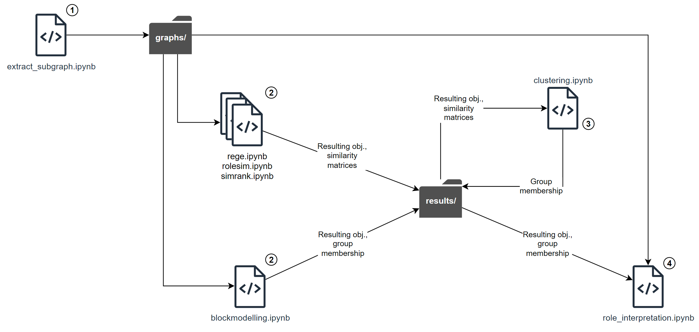

# Equivalence-based role mining in network

Edge lists are not stored in this repo to keep the repo small. For the code to work, create a folder called `/data` at the root of the repo and put all the `.parquet` edges lists in it.

Your repo folder should look like this.

```bash
.
├── README.md
├── data
│   ├── df_edge_list_directed_users_combined_postings_replies_and_votes_to_postings_net.parquet
│   ├── df_edge_list_directed_users_combined_postings_replies_and_votes_to_postings_net_and_follow_connections.parquet
│   ├── df_edge_list_directed_users_postings_replies.parquet
│   ├── df_edge_list_directed_users_votes_to_postings_net.parquet
│   ├── df_edge_list_undirected_users_click_similarity.parquet
│   ├── df_edge_list_undirected_users_combined_postings_replies_and_votes_to_postings_net.parquet
│   ├── df_edge_list_undirected_users_postings_replies.parquet
│   ├── df_edge_list_undirected_users_postings_to_same_articles.parquet
│   ├── df_edge_list_undirected_users_votes_to_postings_net.parquet
│   └── df_edge_list_undirected_users_votes_to_same_postings_net.parquet
├── exploration.Rmd
...
```

## Repo structure



Note: image files in the `results/` folder are mainly for the presentation and final report.

## Running the code

It is be possible to simply run notebook from top to bottom. Code that takes a long time to run are skipped by default, which can be configured to run by simply setting the corresponding switch variable.
