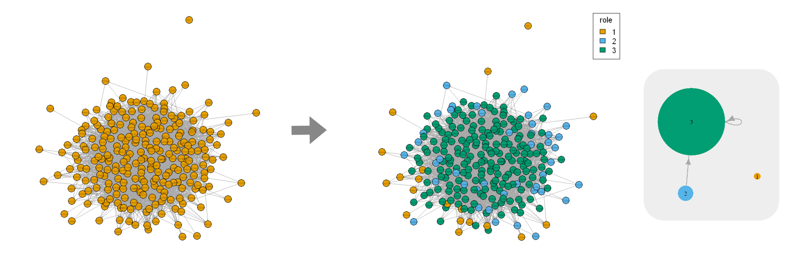

# Equivalence-based role mining in network

This project explores equivalence-based role mining using three types of equivalence: structural, automorphic, and regular. It applies algorithms for each equivalence type, including Euclidean distance, SimRank, RoleSim, REGE, and Blockmodelling, to identify and categorise user roles within subgraphs derived from the Der Standard online forum networks capturing the users’ behaviour. In case pairwise similarity is produced by an approximation algorithm, further clustering analysis is performed to assign nodes to clusters. Results indicate that the REGE and Blockmodelling algorithms allow us to infer user roles (network positions) and their relationships.

*Data is not shared due to agreement with the university*

## Repo structure

Note: image files in the `results/` folder are mainly for the presentation and final report.

## Running the code

For the R code, after installing to required libraries, it is possible to simply run each notebook from top to bottom. Code cells that take a long time to run are skipped by default. This behaviour can be configured by simply setting the corresponding switch variable.

For the Python code, first install the requirements in the `.txt` file of the respective `.py` files. E.g., `requirements_rolesim.txt` for `rolesim.ipynb`.

## Reference

Doran, D. (2017). Equivalence-Based Role Mining. In: Network Role Mining and Analysis. SpringerBriefs in Complexity. Springer, Cham. [https://doi.org/10.1007/978-3-319-53886-0_3](https://doi.org/10.1007/978-3-319-53886-0_3)