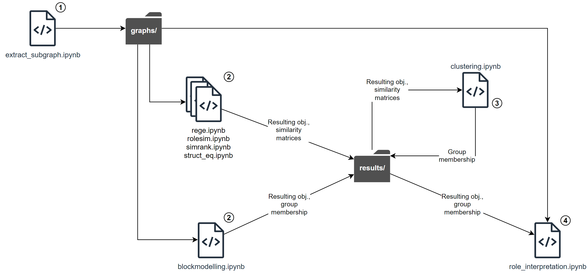

# Equivalence-based role mining in network

## Repo structure

Note: image files in the `results/` folder are mainly for the presentation and final report.

## Running the code

It is possible to simply run each notebook from top to bottom. Code cells that take a long time to run are skipped by default. This behaviour can be configured by simply setting the corresponding switch variable.
